# LIFESAFE

**A mental wellness app that bridges the gap between proactive wellness and reactive care.**

LIFESAFE combines mood journaling, a daily check-in calendar, real-time chat, an in-app AI therapy companion, and guided wellness resources into a single low-friction experience — so users can get support without navigating fragmented apps or clinical intake systems.

Built during the UConn NEXT Fellowship (Vergnano Institute for Impact) in partnership with The Cigna Group, Summer 2026.

**Team:** Jayden Ankrah, Leonardo Odaguire, Dylan Kukulka

---

## Screenshots

| Login | Create Account |
|---|---|
| 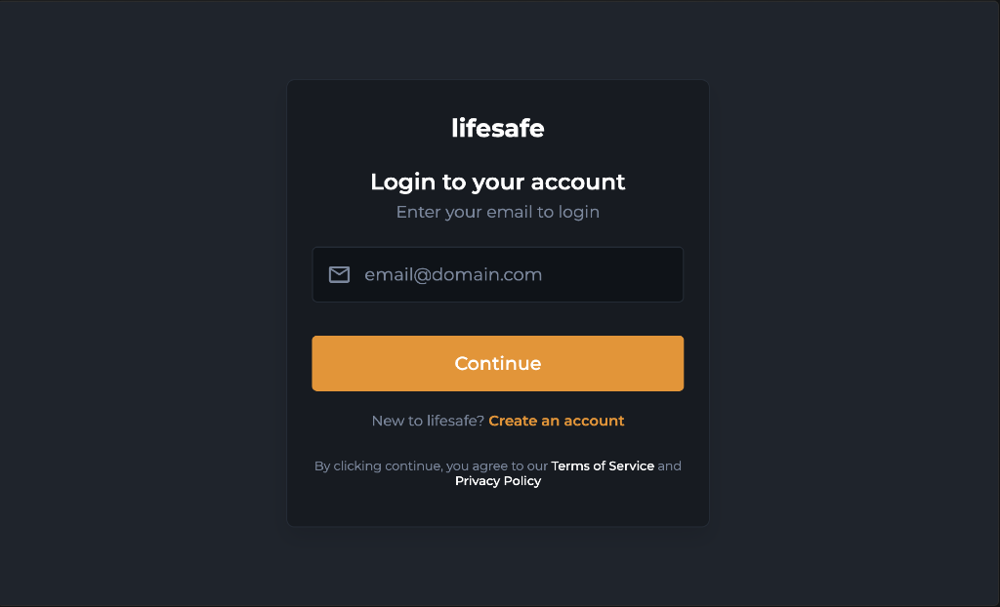 | 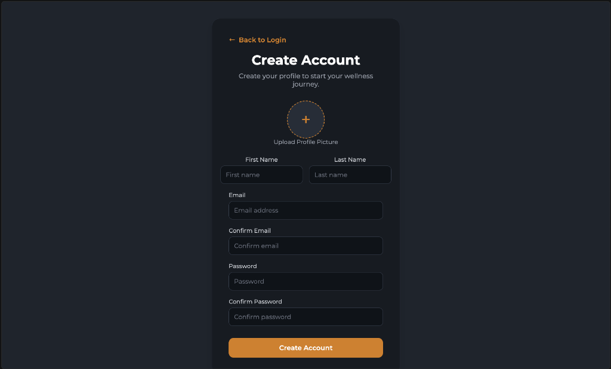 |

| Calendar | Journal Entry |
|---|---|
| 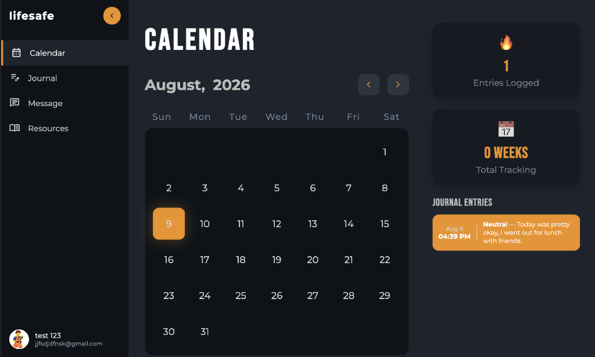 | 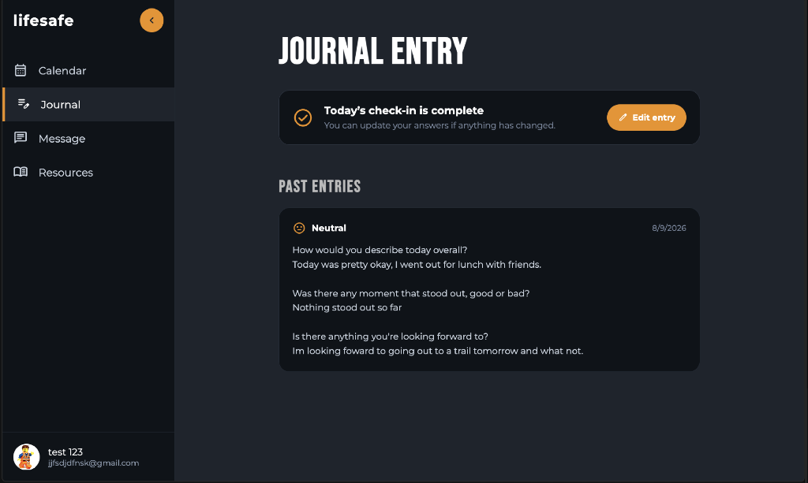 |

| AI Therapy Companion | Get Help Now |
|---|---|
| 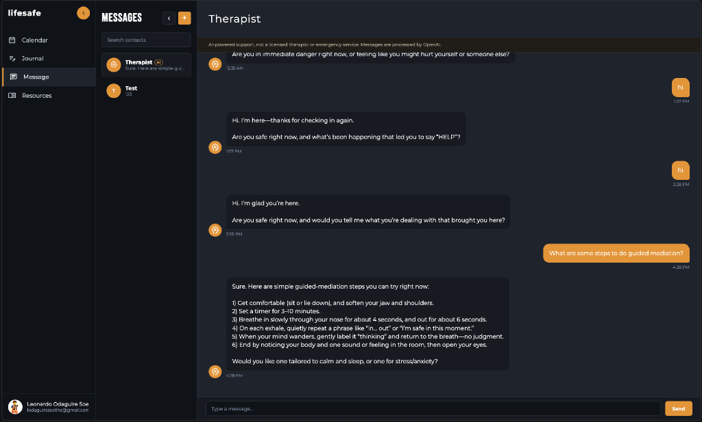 | 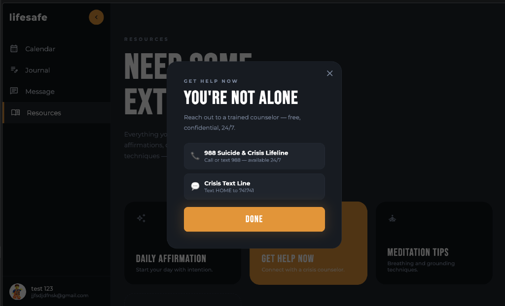 |

| Daily Affirmation | Guided Meditation |
|---|---|
| 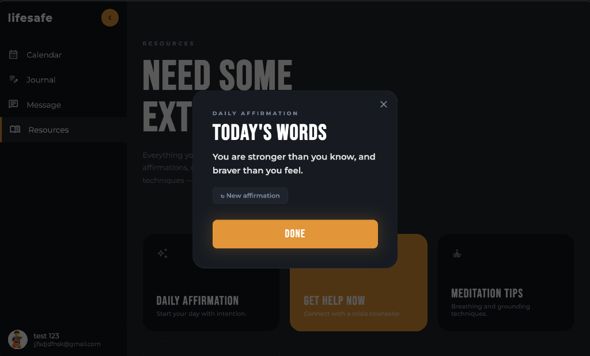 | 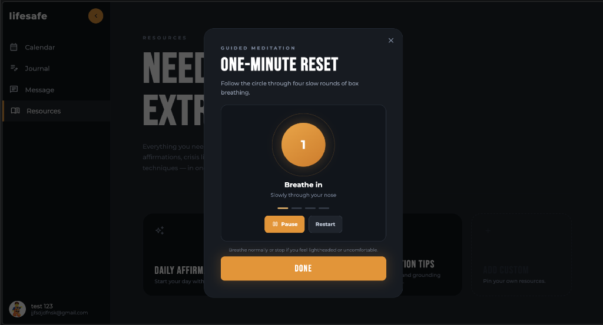 |

| Add a Friend | Messaging |
|---|---|
| 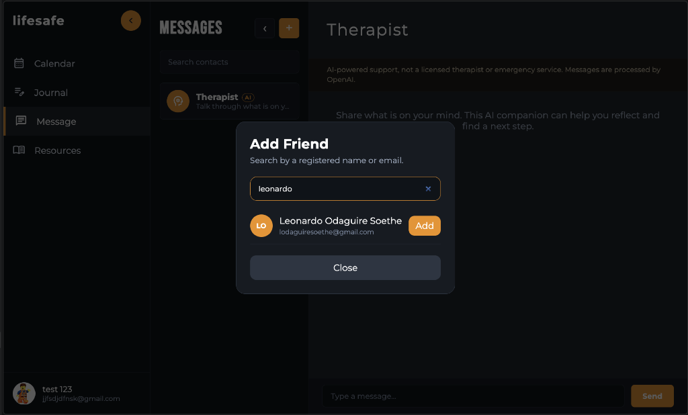 | 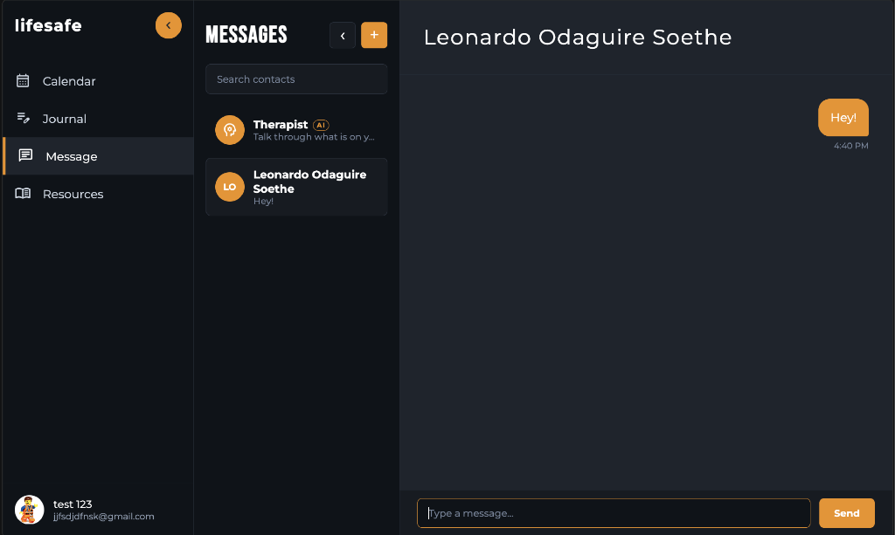 |

---

## The Problem

- **Traditional care is clinical** — high barrier to entry, stigma, and delayed response times make it inaccessible for immediate needs.
- **Most apps are fragmented** — users have to jump between meditation apps, journaling tools, and crisis hotlines, adding cognitive load during moments of stress.

## What LIFESAFE Does

- **Daily check-in & calendar** — log in and record your mood for the day, with the option to privately journal or share your mood with friends.
- **AI therapy companion** — a streaming AI-powered chat that gives users a judgment-free space to talk through what they're feeling, with no barriers to starting.
- **"Get Help Now" resources** — during acute stress, decision fatigue is high. This connects users directly to the 988 Suicide & Crisis Lifeline and Crisis Text Line without complex navigation.
- **Daily affirmations & guided meditation** — lightweight, on-demand tools (like a one-minute box-breathing reset) for day-to-day emotional regulation.
- **Friends & messaging** — add friends and share how you're doing, with an option to signal "I'd appreciate someone checking in."
- **Secure login** — email-based authentication with account creation and validation.

## Tech Stack

**Frontend:** React + Vite
**Backend:** FastAPI (Python)
**Real-time / Infra:** WebSockets, AWS API Gateway, AWS Lambda, AWS DynamoDB, AWS S3 (profile pictures)
**AI:** LLM-powered chat integration for the in-app therapy companion (optional RAG via a vector DB)
**Tooling:** Figma (prototyping), Git/GitHub + GitHub Projects (planning), GitHub Actions (CI/CD), VS Code

## Architecture

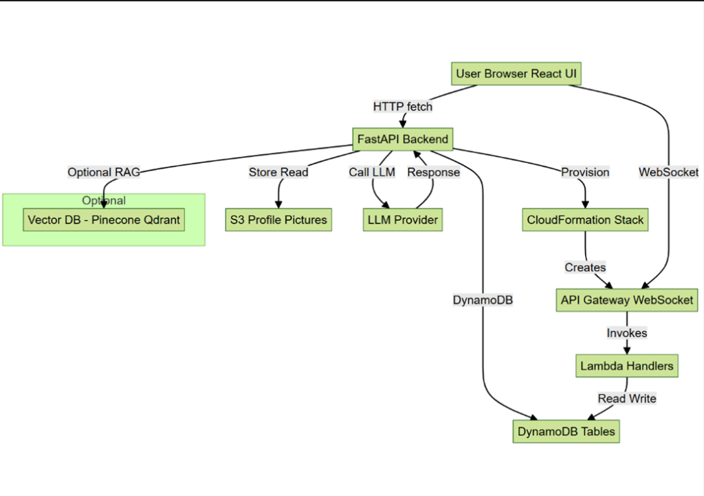

- **Frontend → Backend:** the React UI talks to the FastAPI backend over HTTP for standard requests and over WebSocket (via API Gateway) for real-time messaging.
- **Backend (FastAPI):** handles auth, reads/writes to DynamoDB, calls the LLM provider for the AI companion, and stores profile pictures in S3.
- **Infrastructure:** a CloudFormation stack provisions the API Gateway WebSocket API and Lambda handlers, which read and write to DynamoDB tables in response to real-time events.

## Development Process

We tracked our sprint work with a GitHub Projects Kanban board across Backlog → Ready → In Progress → In Review → Done:

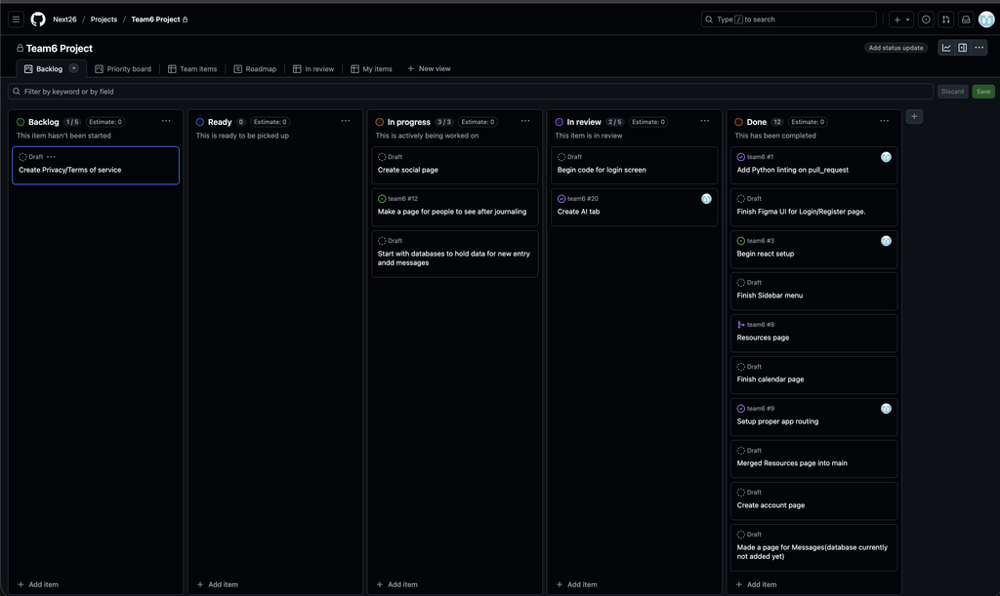

### Roadmap

| Phase | Timeframe | Focus |
|---|---|---|
| Prototyping | May | Figma wireframes mapping the core mental health experience |
| Core build-out | Early June | React + Vite structure, routing, account creation and login |
| Real-time features | Late June – Early July | WebSocket chat, AWS Lambda/DynamoDB integration |
| AI integration | Early – Late July | Streaming AI backend connected to frontend for the therapy companion |
| QA & polish | Late July – Early August | Bug fixes and refinement ahead of the final presentation |

## Getting Started

```bash
# Frontend
cd frontend
npm install
npm run dev

# Backend
cd backend
pip install -r requirements.txt
uvicorn main:app --reload
```

> Note: the backend depends on AWS resources (API Gateway, Lambda, DynamoDB, S3) provisioned through AWS Academy Learner Lab. A live-hosted demo may not always be available since Learner Lab environments are temporary — see the screenshots above for the app in action.

## Presentation

The full project presentation (problem framing, architecture, and demo) is available here: [LIFESAFE presentation (PDF)](docs/lifesafe-presentation.pdf)

## Team

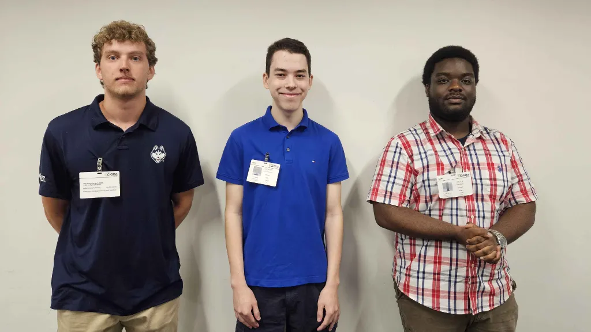

- **Jayden Ankrah** — [LinkedIn](https://www.linkedin.com/in/jayden-ankrah/) · [Personal site](https://sites.google.com/view/who-is-jayden-ankrah/home)
- **Leonardo Odaguire**
- **Dylan Kukulka**

*Built as part of the UConn NEXT Fellowship (Vergnano Institute for Impact) in partnership with The Cigna Group.*
